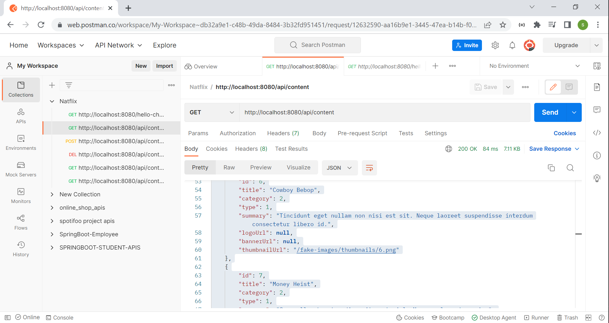
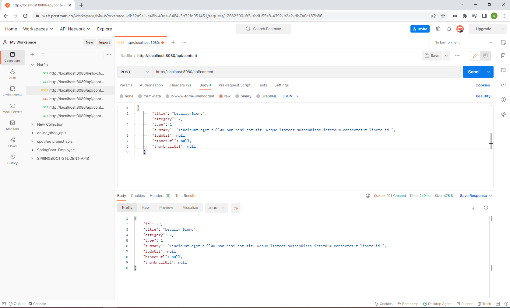
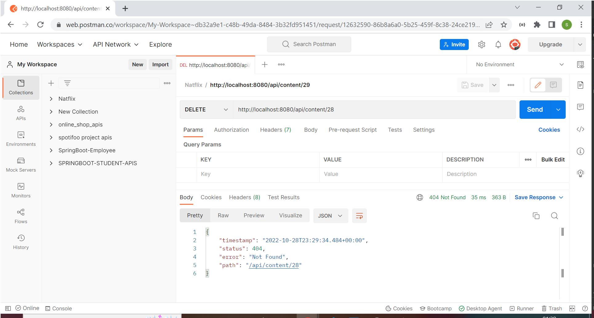
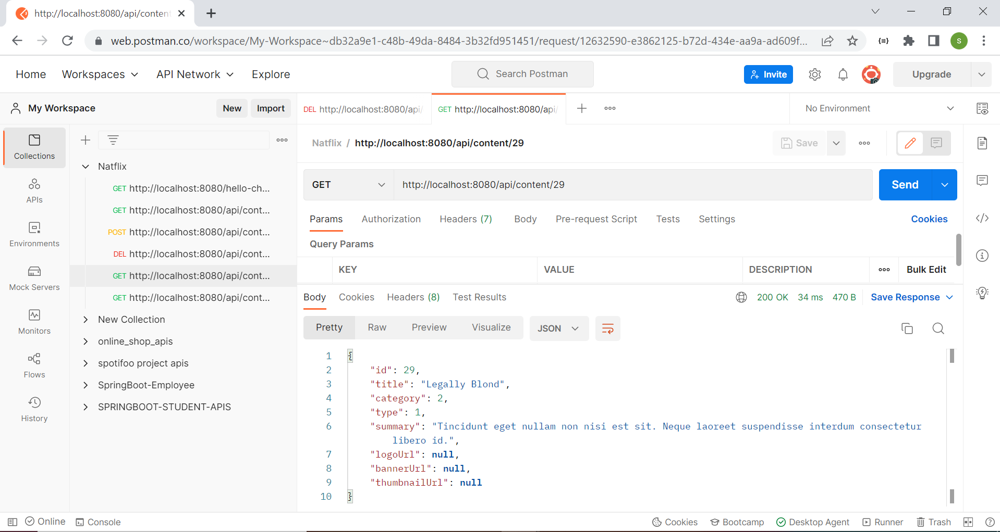
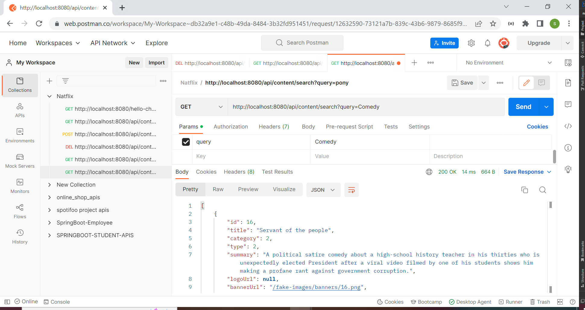

# natflix

## Project description

In this project we created a springboot application by using following dependencies to fetch content,
create, delete and search required content.

```
For connecting springboot application to mysql database
   <dependency>
      <groupId>mysql</groupId>
      <artifactId>mysql-connector-java</artifactId>
   </dependency>
```
```
For springboot jpa
   <dependency>
      <groupId>org.springframework.boot</groupId>
      <artifactId>spring-boot-starter-data-jpa</artifactId>
   </dependency>
```
```
For creating springboot web app
   <dependency>
      <groupId>org.springframework.boot</groupId>
      <artifactId>spring-boot-starter-web</artifactId>
   </dependency>
   <dependency>
      <groupId>org.springframework.boot</groupId>
      <artifactId>spring-boot-starter-test</artifactId>
      <scope>test</scope>
   </dependency>
```
```
This dependency Lombok is a Java library tool that generates code for minimizing boilerplate code.
The library replaces boilerplate code with easy-to-use annotations for example  @ToString, @EqualsAndHashCode, 
@Getter / @Setter and @RequiredArgsConstructor together.
   <dependency>
      <groupId>org.projectlombok</groupId>
      <artifactId>lombok</artifactId>
      <version>1.18.20</version>
      <scope>provided</scope>
   </dependency>
```
## Software and framework used inside this project
1. Springboot
2. Mysql
3. Rest Apis

## How to run the backend code
#### 1. Create database for backend
To create required database and tables import or in mysql work bench click on
 icon to
open create_tables.sql file.
Path to the required file is natflix\src\main\java\com\springboot\natflix\mysql\create_tables.sql
After importing it click on ⚡ icon to run the sql script.
To fill dummy data inside the table import or in mysql work bench click on
 icon to
open insert_data.sql file.
Path to the required file is  natflix\src\main\java\com\springboot\natflix\mysql\insert_data.sql.
After importing it click on ⚡ icon to run the sql script.

#### 2. Run backend code
Open backend code inside your IDE and open file NatflixApplication. Click on

> **Warning**
>  Your mysql must be running before you run backend code otherwise the code will not run 
> and will give you en error.
## Path to database diagram file
natflix\src\main\java\com\springboot\natflix\assets\images


## Path to mysql database files
natflix\src\main\java\com\springboot\natflix\mysql

1. To create required database and tables use create_tables.sql file.
   natflix\src\main\java\com\springboot\natflix\mysql\create_tables.sql
2. To fill dummy data inside the table use insert_data.sql file.
   natflix\src\main\java\com\springboot\natflix\mysql\insert_data.sql

## End points
1. http://localhost:8080/api/content
   METHOD: GET
   Description
   This endpoint will be used to fetch all content saved inside database.
   

2. http://localhost:8080/api/content
   METHOD: POST
   Description
   This endpoint will be used to create new content and save it inside database.
   

3. http://localhost:8080/api/content/:id
   METHOD: DELETE
   Description
   This endpoint will be used to delete content based on content id.
   

4. http://localhost:8080/api/content/:id
   METHOD: GET
   Description
   This endpoint will be used to fetch content by id.
   


5. http://localhost:8080/api/content/search?query=Horror
   METHOD: GET
   Description
   This endpoint will be used to fetch required search data.
   

## Exception handling


## Link to product backlog
https://trello.com/invite/b/hmyd3zzF/ATTI9946e470e641bea2e5cd6612d30bba4a73B119B4/agile-board-template-trello